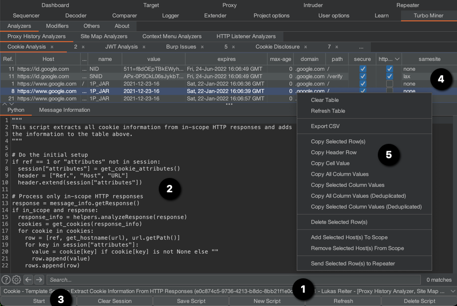

# Turbo Data Miner

Turbo Data Miner is a [Burp Suite Extension](https://portswigger.net/bappstore/84350b8f090a4388a9d12cca141f201b), which
adds a new tab `Turbo Miner` to Burp Suite's UI as well as a new entry `Turbo Data Miner` 
to Burp Suite's `Extensions` context menu entry. In the new tab, you are able to write new or select 
existing Python scripts that are executed on each request/response item currently stored in the Proxy History, Side 
Map, or on each request/response item that is sent or received by Burp Suite.
  
The objective of these Python scripts is the flexible and dynamic extraction, correlation, and structured 
presentation of information from the Burp Suite state as well as the flexible and dynamic on-the-fly modification 
of outgoing or incoming HTTP requests. Thus, Turbo Data Miner shall aid in gaining a better and faster understanding of 
the data collected and processed by Burp Suite.

The following screenshot provides an example how Turbo Data Miner can be used to obtain a structured presentation of all 
cookies (and their attributes) that are stored in the current Burp Suite project. At the bottom, we select the 
corresponding Python script in the dropdown menu (see 1), which automatically loads the selected Python script into the 
IDE text area (see 2) and there, we can customize it, if needed. Alternatively, we can create our own script by 
clicking button `New Script`. The analysis is started by clicking button `Start` (see 3). Afterwards, Turbo Data Miner 
executes the compiled Python script on each Request/Response item. Thereby, the script extracts cookie 
information from each response (see source code in 2) and adds it to the table (see 4). Finally, in the table, we 
can sort per column to gain a better understanding of each cookie attribute or we can perform additional operations 
via the table's context menu (see 5).

As we can see, with Python skills, an understanding of the 
[Burp Suite Extender API](https://portswigger.net/Burp/extender/api/index.html) as well as an understanding of Turbo 
Miner's API (see Turbo Data Miner tab `About` or directly the 
[HTML page](https://github.com/chopicalqui/TurboDataMiner/blob/master/turbodataminer/about.html) used by the `About` tab), 
we can extract and structure any information available in the current Burp Suite project.

# Usage

Refer to [Turbo Data Miner's Wiki](https://github.com/chopicalqui/TurboDataMiner/wiki).

# Author

**Lukas Reiter** ([@chopicalquy](https://twitter.com/chopicalquy)) - 
[Turbo Data Miner](https://github.com/chopicalqui/TurboDataMiner)

# License

This project is licensed under the GPLv3 License - see the 
[license](https://github.com/chopicalqui/TurboDataMiner/blob/master/LICENSE) file for details.